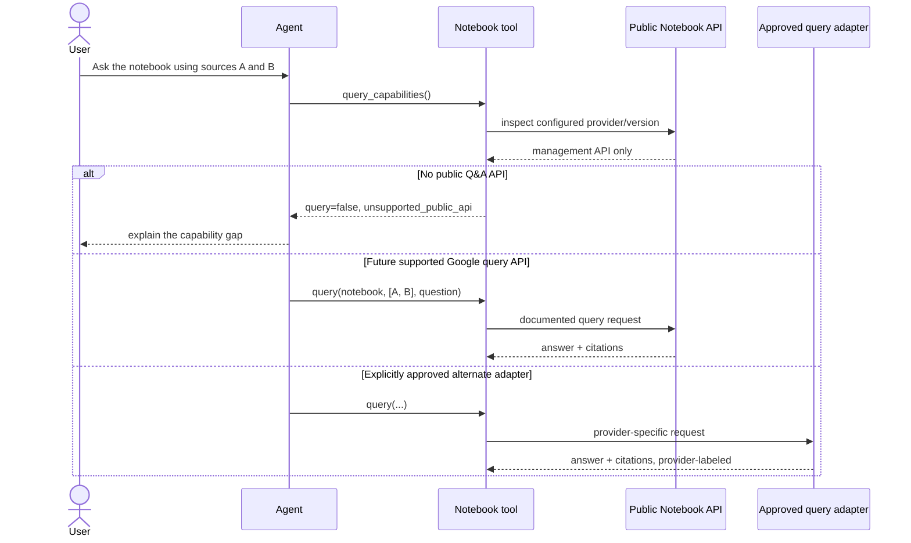
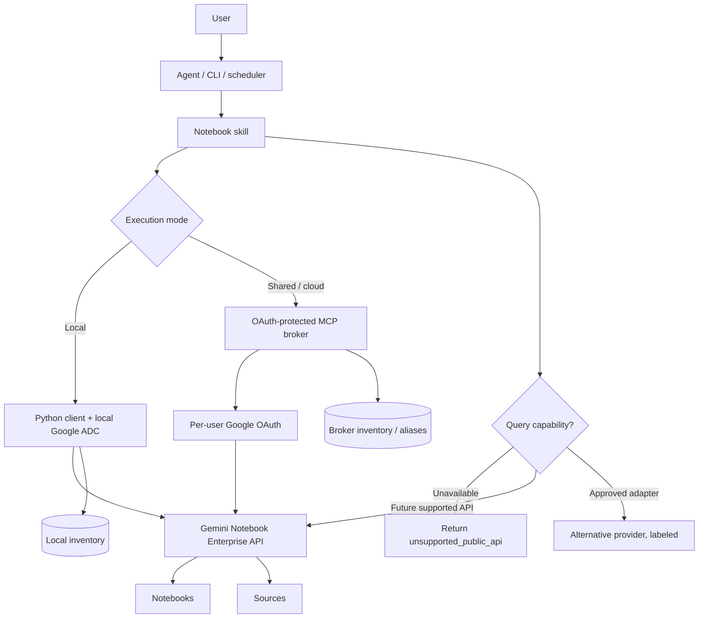

# Agent integration — Codex, Claude Code, MCP

## Two independent auth layers

Keep these apart in your head and in your diagrams:

- **Agent-platform auth** — who may run Codex / Claude Code.
- **Google authorization** — what that principal may touch inside Gemini Notebook Enterprise.

An OpenAI API key or ChatGPT login grants **zero** notebook access. A Google OAuth token
authenticates **nothing** to the agent platform. Every "why can't the agent see my notebooks"
question resolves to one of these two layers, so log which identity and which Cloud project a call
used.

## Choosing an execution mode

| Pattern | Shape | Best for | Trade-off |
|---|---|---|---|
| Direct script/CLI | Python → Google OAuth/ADC → Notebook API | personal admin, inventory jobs | Google credentials sit on the workstation |
| Agent-local skill | agent → skill script → local ADC → Google | individual developer/researcher | agent can invoke a local tool; sandbox permissions matter |
| Local STDIO MCP | agent → STDIO MCP → Google | cleaner tool contract, credentials never leave the machine | per-machine install |
| Remote MCP broker | agent → OAuth MCP → broker → Google | teams, cloud agents, governed automation | you operate a secure auth service |
| Scheduled automation | cron → broker/API → Google | inventory + health sync | user-delegated authorization and licensing need real design |
| Browser/client-side | browser → OAuth → backend → API | interactive UI | token handling and CORS are worse; put a backend in front |

Start at the top of the table and stop at the first row that holds.

## Why cloud agents need a broker

Hosted agent environments (Codex cloud among them) commonly make setup **secrets unavailable
during the agent phase** and disable outbound network access unless explicitly allowed. Copying a
Google refresh token into such an environment is therefore both unreliable and a bad security
trade.

The broker inverts it: the long-lived Google credential stays inside your infrastructure's secret
boundary, and the agent holds only a short-lived, revocable session against one allowed origin.
That also lets you allowlist a single MCP domain instead of the whole Google API surface.

## Broker tool + scope design

Expose a narrow tool set, not the raw API:

```text
notebooks.list      notebooks.get
sources.list        sources.get       sources.health
sources.add
sources.delete      notebooks.share
notebooks.query     notebooks.query_capabilities
```

Tier them by blast radius, and make the tiers real (separate scopes, separate consent):

```text
Default:                          notebooks.list, notebooks.get, sources.list,
                                  sources.get, sources.health
Elevated:                         sources.add
Destructive / explicit consent:   sources.delete, notebooks.share
Capability gated:                 notebooks.query
```

Broker-side application scopes — **your** namespace, not Google's or the agent platform's:

```text
notebook.read   source.read   source.write   notebook.share   notebook.query
```

Map them to Google OAuth + IAM inside the broker. A read-only research agent that cannot request
`source.write` cannot delete a source no matter what a prompt or a source document says.

Registering a Streamable HTTP MCP server from the Codex CLI looks like:

```bash
codex mcp add notebook-broker --url https://notebook-broker.example.com/mcp
```

```bash
codex mcp login notebook-broker --scopes notebook.read,source.read
```

## Skill packaging

Both runtimes read a folder with a required instruction file plus optional `scripts/`,
`references/`, `assets/`. Repo-scoped Codex skills live under `.agents/skills/`; reusable personal
skills under the user's Codex skills directory. Claude Code reads `~/.claude/skills/`.

The agent sees only name + description until it selects the skill, so the description must state
**what it does and when to invoke it**, including the negative case ("do not invent undocumented
Notebook query endpoints").

## Capability negotiation, in sequence



The rule the diagram encodes: **the tool never silently swaps in a different retrieval engine and
calls the result "NotebookLM."**

## Target architecture



Enterprise API as the control plane, resource names as the identity layer, OAuth + IAM as the
trust layer, MCP as the agent boundary, query as an explicit capability.
