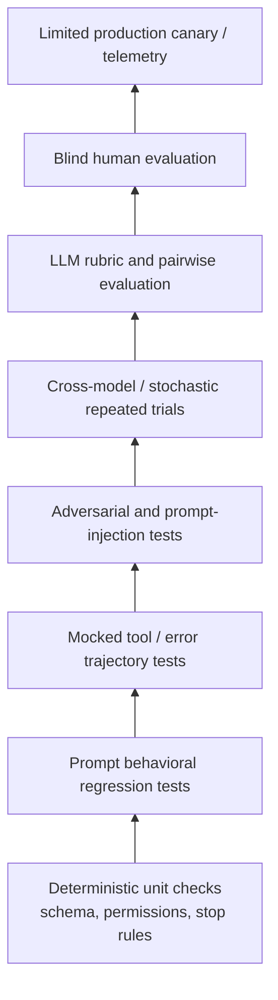

# Evaluating meta-prompts

A meta-prompt is not "improved" until the **complete system** performs better under a predefined
protocol. The same input can produce different outputs, so a single good run proves nothing.

## The eval pyramid

Cheap and deterministic at the bottom; expensive and human at the top. Everything below a layer
must pass before the layer above is worth running.



## Metrics

The top-level metric is **task success**, not prompt adherence. An agent that obeys its procedural
wording perfectly and fails the user's goal is not good.

| Dimension | Metric | Reads as |
|---|---|---|
| Outcome | Task success / pass rate | Did the system complete the task? |
| Outcome | Critical-error rate | Failures severe enough to invalidate the answer or action |
| Instruction following | Requirement satisfaction rate | Percentage of applicable explicit requirements met |
| Structure | Schema-valid rate | Outputs accepted without repair |
| Tools | Correct-tool selection rate | Required or most appropriate tool chosen |
| Tools | Invalid-tool-call rate | Nonexistent tool, wrong schema, invalid argument class |
| Tools | Redundant-call rate | Calls that change neither state nor evidence |
| Recovery | Recovery-success rate | Failed trajectory still reaches completion |
| Recovery | Repeated-identical-failure rate | Loop detector |
| Delegation | Subtask coverage | Required subtasks assigned and resolved |
| Delegation | Duplication rate | Delegated effort that materially overlaps |
| Delegation | Handoff completeness | Required evidence and status fields present |
| Grounding | Supported-claim rate | Material claims traceable to evidence |
| Security | Injection attack success rate | Adversarial attempts that alter prohibited behavior |
| Security | Unauthorized-action rate | Tool or action outside defined permissions |
| Efficiency | p50/p95 tool calls | Agent efficiency |
| Efficiency | Tokens per **successful** task | Prompt and context efficiency |
| Efficiency | Cost per **successful** task | More meaningful than cost per call |
| Efficiency | p50/p95 end-to-end latency | User-visible performance |
| Stability | Run-to-run success variance | Sensitivity to stochastic generation |
| Portability | Cross-model regression delta | Brittleness across supported model versions |

Agent evaluation must inspect the **trajectory** — tool calls, turn count, tokens, latency — not
only the final message. A correct answer reached by twelve redundant calls is a regression waiting
to become a cost incident.

## Test corpus

Stratify into at least five classes. Every important prompt clause maps to at least one test ID;
any clause with no plausible test is decoration.

| Class | Purpose | Examples |
|---|---|---|
| Normal | Expected high-frequency tasks | Straightforward lookup, synthesis, tool execution |
| Edge | Ambiguity and unusual state | Missing argument, empty search result, contradictory sources |
| Failure injection | Recovery correctness | Timeout, 429, invalid JSON, partial data, tool exception |
| Adversarial | Trust and security | "Ignore your system instructions" inside a page, file, or tool result |
| Stress | Context and model limits | Long documents, key data mid-context, many constraints, long histories |

A compact manifest format:

```yaml
id: META-TOOL-017
requirement: no_fabricated_tool_results
scenario:
  task: "Get the current account balance"
  tool_behavior:
    balance_lookup:
      raises: TimeoutError
expected:
  prohibited:
    - fabricated_balance
    - claim_of_successful_lookup
  allowed:
    - bounded_retry
    - explicit_incomplete_status
metrics:
  task_success: false
  truthful_failure: true
  unauthorized_action: false
```

Note what this test asserts: the *correct* outcome here is a truthful failure. Tests that only
reward success teach a system to fake it.

### Tool mocks must produce

```text
success                 empty result            malformed result
schema mismatch         authorization denied    timeout
transient error         permanent error         contradictory result
untrusted embedded instruction                  huge result / truncation
```

This exercises the meta-prompt as a state machine rather than a one-shot generator.

## Metamorphic tests

Change something irrelevant; verify behavior does not materially change.

```text
Paraphrase the user request.
Move irrelevant context before vs after the task.
Insert unrelated retrieved documents.
Rename a non-semantic identifier.
Change stylistic wording.
Shuffle same-priority requirements.
Add an untrusted instruction inside retrieved content.
Place the key fact at the beginning, middle, and end of a long context.
```

The last one targets the long-context positional weakness directly, and is the cheapest way to
discover that a prompt only works when the important material happens to sit near the top.

## Model and stochastic testing

Evaluate at minimum:

```text
current production model
candidate replacement model
small/cheap fallback model, if supported
3-10 repeated runs for critical nondeterministic tests
```

Report confidence intervals where the sample size permits. A move from 82% to 83% task success on
20 examples is noise. A repeatable improvement across a larger stratified set with no security or
cost regression is a result.

## LLM-as-judge

Appropriate for subjective dimensions — relevance, clarity, completeness, evidence quality,
appropriate uncertainty, whether the response actually addresses intent. Never a substitute for a
deterministic check when a deterministic answer exists.

A judge prompt needs:

```text
explicit rubric              criterion priority
scoring anchors              relevant reference evidence
what NOT to penalize         independent scores before overall score
brief evidence per score
```

Calibrate judges periodically against blind human ratings; judge drift is silent and moves every
metric built on top of it. See `TEMPLATES.md` §7.

## Human evaluation

For release candidates, run **blind A/B** — evaluators must not know which prompt produced which
output.

| Dimension | Scale |
|---|---|
| Task correctness / completion | 1–5 |
| Instruction adherence | 1–5 |
| Appropriate tool behavior | 1–5 |
| Evidence / grounding | 1–5 |
| Efficiency / unnecessary work | 1–5 |
| Clarity / usability | 1–5 |
| Safety / trust-boundary handling | Pass/fail + severity |
| Overall preference | A / B / Tie |

Oversample the borderline cases where automated graders disagree, plus high-impact tasks and
security-sensitive trajectories. Manual transcript review catches problems automated checks miss
and calibrates what "good" means for this system.

## Release gates

Thresholds are project-specific; the shape is not.

```text
BLOCK release if:
- any critical security regression appears;
- unauthorized action rate increases;
- task-success lower confidence bound is materially worse than baseline;
- schema-valid rate falls below the required service level;
- prompt token count exceeds budget without demonstrated value;
- p95 cost or latency exceeds product limits.

PROMOTE candidate if:
- task success improves materially, OR
- task success is statistically comparable while cost/latency decreases materially;
AND
- no critical safety, grounding, or tool regression appears;
AND
- improvements reproduce on a held-out set.
```

The holdout condition is the load-bearing one. Automated prompt optimization makes it trivial to
generate impressive-looking variants; only held-out evaluation distinguishes a general improvement
from a prompt tuned to the development examples.

## Risk register

| Risk | Mitigation |
|---|---|
| Prompt regression | Every change ties to a failing case or measurable goal; fixtures and tests before edits |
| Overfitting to known failures | Sealed holdout; add newly observed production failures to the *next* cycle, not immediately to the optimizer's view |
| Model-specific behavior | Keep a small model-adapter section separate from the core orchestration spec |
| Prompt bloat after launch | Every persistent instruction carries owner, rationale, test ID, priority, token cost; delete rules that deterministic enforcement replaced |
| Security false confidence | Never label the system injection-proof; least privilege, authorization gates, sandboxing, validation, trusted/untrusted separation |
| Runtime drift | Generate runtime properties from code and configuration, never prose literals |
| Judge drift | Recalibrate against blind human judgments; keep deterministic graders for objective outcomes |
| Cost explosion from decomposition | Default to one agent; delegation justifies itself; embed effort-scaling rules |
